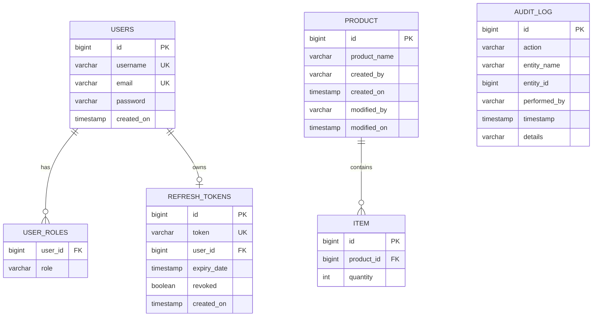

# Product Management RESTful API

[](https://www.oracle.com/java/)
[](https://spring.io/projects/spring-boot)
[](https://spring.io/projects/spring-security)
[](README.md)
[](https://www.docker.com/)
[](LICENSE)

A production-grade RESTful API built with **Java 17**, **Spring Boot 3**, **Spring Data JPA**, **PostgreSQL**, **Spring Security (JWT with Refresh Token Rotation)**, **Jakarta Validation**, **OpenAPI / Swagger 3**, and **Docker Compose**.

Developed as part of the **Zest India IT Pvt. Ltd.** Technical Assessment.

---

## 📑 Table of Contents
- [Architecture & Design](#-architecture--design)
- [Tech Stack](#-tech-stack)
- [Database Schema & ER Diagram](#-database-schema--er-diagram)
- [Security & Refresh Token Rotation](#-security--refresh-token-rotation)
- [API Endpoints & Documentation](#-api-endpoints--documentation)
- [Quick Start Guide](#-quick-start-guide)
  - [1. Running with Docker Compose (Recommended)](#1-running-with-docker-compose-recommended)
  - [2. Running Locally with Maven](#2-running-locally-with-maven)
- [Running Automated Tests](#-running-automated-tests)
- [Sample Requests & cURL Commands](#-sample-requests--curl-commands)
- [Postman Collection](#-postman-collection)
- [Evaluation Checklist](#-evaluation-checklist)

---

## 🏗 Architecture & Design

The application follows **Clean / Layered Architecture** with strict separation of concerns:

```
src/main/java/com/zest/assignment/
├── ZestAssignmentApplication.java  # Spring Boot Main Entry Point
├── config/                         # App Configurations (Security, JPA Auditing, OpenAPI, CORS, Async)
│   ├── ApplicationAuditorAware.java
│   ├── AsyncConfig.java
│   ├── CorsConfig.java
│   ├── JpaAuditingConfig.java
│   ├── OpenApiConfig.java
│   └── SecurityConfig.java
├── controller/                     # REST Controllers with /api/v1 versioning
│   ├── AuthController.java
│   ├── ProductController.java
│   └── ItemController.java
├── dto/                            # Data Transfer Objects & Standard API Envelopes
│   ├── request/                    # Validated Request Payloads
│   └── response/                   # Standardized JSON Responses (ApiResponse, ErrorResponse, PagedResponse)
├── entity/                         # JPA Domain Entities
│   ├── Product.java
│   ├── Item.java
│   ├── User.java
│   ├── Role.java
│   ├── RefreshToken.java
│   └── AuditLog.java
├── exception/                      # Custom Exceptions & Centralized Global Exception Handler
│   ├── BadRequestException.java
│   ├── DuplicateResourceException.java
│   ├── GlobalExceptionHandler.java
│   ├── ResourceNotFoundException.java
│   ├── TokenRefreshException.java
│   └── UnauthorizedException.java
├── repository/                     # Spring Data JPA Data Access Layer
│   ├── ProductRepository.java
│   ├── ItemRepository.java
│   ├── UserRepository.java
│   ├── RefreshTokenRepository.java
│   └── AuditLogRepository.java
├── security/                       # Spring Security & JWT Filter Engine
│   ├── CustomAccessDeniedHandler.java
│   ├── JwtAuthenticationEntryPoint.java
│   ├── JwtAuthenticationFilter.java
│   ├── JwtTokenProvider.java
│   ├── SecurityUtils.java
│   ├── UserDetailsImpl.java
│   └── UserDetailsServiceImpl.java
└── service/                        # Business Logic Layer & Async Services
    ├── AuthService.java / AuthServiceImpl.java
    ├── RefreshTokenService.java / RefreshTokenServiceImpl.java
    ├── ProductService.java / ProductServiceImpl.java
    ├── ItemService.java / ItemServiceImpl.java
    ├── AsyncAuditService.java
    └── DataInitializerService.java
```

---

## 🛠 Tech Stack

| Component | Technology / Library | Version |
|---|---|---|
| **Language** | Java SE (JDK) | 17 LTS |
| **Framework** | Spring Boot | 3.3.3 |
| **Persistence** | Spring Data JPA (Hibernate 6) | 3.3.3 |
| **Database** | PostgreSQL (Prod / Docker) & H2 (Unit & Integration Tests) | 16-alpine / 2.2 |
| **Security** | Spring Security 6 & JJWT (io.jsonwebtoken) | 0.12.6 |
| **Validation** | Jakarta Bean Validation (Hibernate Validator) | 3.0 |
| **API Documentation** | SpringDoc OpenAPI (Swagger UI 3) | 2.6.0 |
| **Testing** | JUnit 5, Mockito, AssertJ, Spring Boot Test, MockMvc | 5.10.3 |
| **Containers** | Docker (Multi-Stage Build) & Docker Compose | 3.8 |
| **Boilerplate Reduction**| Project Lombok | 1.18.34 |

---

## 🗄 Database Schema & ER Diagram

The database structure strictly adheres to the technical specification, with additional indexing, security, and audit capabilities.



### Indexing Strategy
- **`idx_product_name`** on `product(product_name)`: Accelerates product search and duplicate name checks.
- **`idx_product_created_on`** on `product(created_on)`: Optimizes time-based pagination and sorting.
- **`idx_item_product_id`** on `item(product_id)`: Speeds up join lookups and cascade operations.
- **`idx_users_username` & `idx_users_email`**: Unique B-tree indices for fast credential authentication.
- **`idx_refresh_tokens_token`**: Unique index for token lookup and rotation verification.

---

## 🔐 Security & Refresh Token Rotation

1. **Stateless JWT Flow**: Clients authenticate with username/password and receive an Access Token (15 mins) and a Refresh Token (7 days).
2. **Refresh Token Rotation**:
   - Every call to `/api/v1/auth/refresh-token` validates the current refresh token.
   - The used refresh token is **revoked and deleted**.
   - A **brand new refresh token** is issued alongside the new access token.
   - This prevents replay attacks and mitigates token leakage.
3. **Role-Based Access Control (RBAC)**:
   - `ROLE_USER`: Can view products, search, create products, add items, and update quantities.
   - `ROLE_ADMIN`: Has full privileges including deleting products and removing items.
4. **Spring Data JPA Auditing**:
   - `created_by` and `created_on` are automatically set on entity creation.
   - `modified_by` and `modified_on` are automatically populated on updates using the active `SecurityContextHolder` principal.

---

## 🌐 API Endpoints & Documentation

Interactive Swagger documentation is available at:
👉 **`http://localhost:8080/swagger-ui.html`** or **`http://localhost:8080/swagger-ui/index.html`**

| Method | Endpoint | Access | Description |
|---|---|---|---|
| `POST` | `/api/v1/auth/register` | Public | Register a new user |
| `POST` | `/api/v1/auth/login` | Public | Authenticate user & receive tokens |
| `POST` | `/api/v1/auth/refresh-token` | Public | Refresh access token via token rotation |
| `POST` | `/api/v1/auth/logout` | Authenticated | Revoke refresh token |
| `GET` | `/api/v1/products` | User / Admin | Paginated products list with search & sorting |
| `GET` | `/api/v1/products/{id}` | User / Admin | Get product details with item breakdown |
| `POST` | `/api/v1/products` | User / Admin | Create a new product |
| `PUT` | `/api/v1/products/{id}` | User / Admin | Update product details |
| `DELETE` | `/api/v1/products/{id}` | Admin only | Delete a product (cascades to items) |
| `GET` | `/api/v1/products/{id}/items` | User / Admin | Get all items under a product |
| `POST` | `/api/v1/products/{id}/items` | User / Admin | Add an item with quantity to a product |
| `GET` | `/api/v1/items/{id}` | User / Admin | Get item details by ID |
| `PUT` | `/api/v1/items/{id}` | User / Admin | Update item quantity |
| `DELETE` | `/api/v1/items/{id}` | Admin only | Delete an item |
| `GET` | `/actuator/health` | Public | Application health status |

### Standard Response Formats

#### ✅ Success Response Envelope
```json
{
  "success": true,
  "message": "Product created successfully",
  "data": {
    "id": 1,
    "productName": "Enterprise Cloud Server",
    "createdBy": "admin",
    "createdOn": "2026-09-01T23:10:00",
    "modifiedBy": null,
    "modifiedOn": null,
    "items": [],
    "totalItems": 0
  },
  "timestamp": "2026-09-01T23:10:00"
}
```

#### ❌ Standardized Error Response Envelope
```json
{
  "success": false,
  "status": 400,
  "error": "Validation Error",
  "message": "Validation failed for one or more fields",
  "path": "/api/v1/products",
  "timestamp": "2026-09-01T23:10:00",
  "fieldErrors": [
    {
      "field": "productName",
      "rejectedValue": "",
      "message": "Product name is required and cannot be blank"
    }
  ]
}
```

---

## 🚀 Quick Start Guide

### Default Pre-Seeded Accounts
The application automatically seeds initial accounts on first startup:
- **Admin**: `admin` / `Admin@123` (Roles: `ROLE_ADMIN`, `ROLE_USER`)
- **User**: `user` / `User@123` (Role: `ROLE_USER`)

---

### 1. Running with Docker Compose (Recommended)

Ensure Docker & Docker Compose are installed and running on your system.

```bash
# Clone the repository
git clone https://github.com/Dnyaneshwar7821/zest-java-backend-assignment.git
cd zest-java-backend-assignment

# Build and start all services (PostgreSQL + Spring Boot App)
docker compose up --build -d

# Verify containers are healthy
docker compose ps

# View real-time logs
docker compose logs -f api-service
```

Access the application at:
- **API Base URL**: `http://localhost:8080`
- **Swagger UI**: `http://localhost:8080/swagger-ui.html`
- **Health Check**: `http://localhost:8080/actuator/health`

To stop and remove containers:
```bash
docker compose down -v
```

---

### 2. Running Locally with Maven

#### Prerequisites
- Java 17+
- PostgreSQL running locally on port 5432 with database `zest_db` (or test profile / Docker container)

```bash
# Set your PostgreSQL credentials if different from default (postgres/postgres)
export SPRING_DATASOURCE_URL=jdbc:postgresql://localhost:5432/zest_db
export SPRING_DATASOURCE_USERNAME=postgres
export SPRING_DATASOURCE_PASSWORD=postgres

# Run the application using the Maven wrapper
./mvnw spring-boot:run

# On Windows PowerShell
.\mvnw.cmd spring-boot:run
```

---

## 🧪 Running Automated Tests

The test suite runs against an **H2 In-Memory Database** with 100% isolation.

```bash
# Run all unit tests, slice tests, repository tests, and integration tests
./mvnw clean test

# On Windows PowerShell
.\mvnw.cmd clean test
```

### Test Coverage Highlights:
- **30/30 Tests Passing**
- **Unit Tests**: `ProductServiceTest`, `ItemServiceTest`, `AuthServiceTest`, `JwtTokenProviderTest` (with Mockito)
- **Integration Tests**: `AuthControllerIntegrationTest`, `ProductControllerIntegrationTest` (with MockMvc and Spring Boot Test)
- **Repository Tests**: `ProductRepositoryTest` (with `@DataJpaTest` & JPA Auditing)

---

## 💻 Sample Requests & cURL Commands

### 1. Login as Admin
```bash
curl -X POST http://localhost:8080/api/v1/auth/login \
  -H "Content-Type: application/json" \
  -d '{
    "usernameOrEmail": "admin",
    "password": "Admin@123"
  }'
```

### 2. Create a Product
```bash
curl -X POST http://localhost:8080/api/v1/products \
  -H "Authorization: Bearer <ACCESS_TOKEN>" \
  -H "Content-Type: application/json" \
  -d '{
    "productName": "Dell PowerEdge R750"
  }'
```

### 3. Add Items to a Product
```bash
curl -X POST http://localhost:8080/api/v1/products/1/items \
  -H "Authorization: Bearer <ACCESS_TOKEN>" \
  -H "Content-Type: application/json" \
  -d '{
    "quantity": 10
  }'
```

### 4. Get Paginated Products with Search
```bash
curl -X GET "http://localhost:8080/api/v1/products?page=0&size=10&sortBy=productName&direction=asc&search=PowerEdge" \
  -H "Authorization: Bearer <ACCESS_TOKEN>"
```

### 5. Rotate Refresh Token
```bash
curl -X POST http://localhost:8080/api/v1/auth/refresh-token \
  -H "Content-Type: application/json" \
  -d '{
    "refreshToken": "<YOUR_REFRESH_TOKEN>"
  }'
```

### 6. Delete Product (Admin Only)
```bash
curl -X DELETE http://localhost:8080/api/v1/products/1 \
  -H "Authorization: Bearer <ADMIN_ACCESS_TOKEN>"
```

---

## 📮 Postman Collection

A complete, pre-configured Postman collection is included in the root directory:
📁 **[`postman_collection.json`](./postman_collection.json)**

### How to use:
1. Open **Postman** and click **Import**.
2. Select `postman_collection.json`.
3. Execute the `Login Admin` or `Login User` request.
4. Tokens are automatically extracted and injected into collection variables for seamless endpoint testing!

---

## ✅ Evaluation Checklist

| Requirement | Status | Notes |
|---|---|---|
| **Java 17+ & Spring Boot 3** | ✅ Completed | Built on Java 17 LTS & Spring Boot 3.3.3 |
| **Spring Data JPA (Hibernate)** | ✅ Completed | Standard JPA repositories, custom queries, indexing |
| **PostgreSQL & H2** | ✅ Completed | PostgreSQL for prod/docker, H2 for automated tests |
| **Spring Security & JWT** | ✅ Completed | Stateless Bearer authentication with JJWT 0.12.x |
| **Refresh Token Rotation** | ✅ Completed | Automatic token revocation and rotation on refresh |
| **Role-Based Authorization** | ✅ Completed | `ROLE_ADMIN` & `ROLE_USER` with method-level security |
| **Jakarta Validation** | ✅ Completed | Request body and parameter validations with field errors |
| **Standardized Error Handling** | ✅ Completed | `@RestControllerAdvice` with uniform `ErrorResponse` |
| **Pagination & Sorting** | ✅ Completed | Pageable collection endpoints (`/api/v1/products`) |
| **Async Processing** | ✅ Completed | `@EnableAsync` thread pool for audit logging |
| **JUnit 5 & Mockito Tests** | ✅ Completed | 30 unit, integration, and slice tests passing |
| **OpenAPI / Swagger 3** | ✅ Completed | Interactive `/swagger-ui.html` with BearerAuth scheme |
| **Dockerfile & Docker Compose** | ✅ Completed | Multi-stage Dockerfile + PostgreSQL compose setup |
| **Clean Architecture** | ✅ Completed | Controller, Service, Repository, Entity, DTO, Security |
